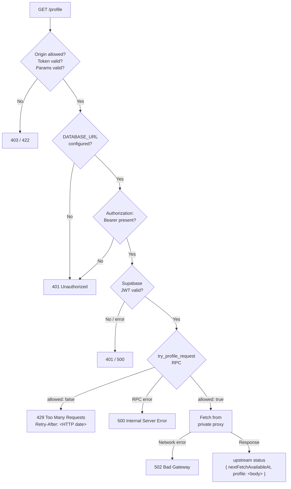

# warframe-api-front-proxy

A Cloudflare Worker that acts as the front proxy for Warframe API endpoints, for use by [browse.wf](https://github.com/dsinn/browse.wf).

## Why

The Warframe API (`api.warframe.com`) does not send CORS headers, so browser-based apps cannot fetch from it directly. The API's WAF also returns 403 for all requests originating from Cloudflare Worker egress IPs. This Worker therefore routes requests through a private proxy on shared hosting, which makes plain HTTP requests from a non-Cloudflare IP.

## Architecture

See the [system diagram in browse.wf](https://github.com/dsinn/browse.wf#warframe-api-proxy-optional).

## Private Proxy Interface

The private proxy must be a simple HTTP server accessible at a single URL. The Worker calls it as follows:

- **Method**: `GET`
- **Query parameter**: `url` — the full Warframe API URL to fetch (URL-encoded)
- **Expected response**: the upstream JSON body, with `Content-Type: application/json`
- **On upstream error**: any non-200 status code

The private proxy should reject requests where the `X-Private-Proxy-Secret` header does not match its configured `PRIVATE_PROXY_SECRET` value, to prevent direct browser or script access to its URL.

An example implementation is available at [warframe-api-private-proxy-php](https://github.com/dsinn/warframe-api-private-proxy-php).

## Endpoints

| Path | Query params | Upstream |
|---|---|---|
| `/worldState` | — | `https://api.warframe.com/cdn/worldState.php` |
| `/profile` | `platform`, `playerId` | `http://content[-platform].warframe.com/dynamic/getProfileViewingData.php` |

### `/profile` request flow



## Environment Variables

| Variable | Description |
|---|---|
| `ALLOWED_HOST` | The hostname allowed to call this Worker (e.g. `dsinn.github.io`). `localhost` and `127.0.0.1` with any port are always allowed for local dev. |
| `WARFRAME_API_FRONT_PROXY_TOKEN` | Shared secret token; must match the value sent by browse.wf clients via `X-Warframe-API-Front-Proxy-Token` header |
| `PRIVATE_PROXY_URL` | Full URL to the private proxy script (e.g. `https://example.com/proxy.php`) |
| `PRIVATE_PROXY_SECRET` | *(Optional)* Shared secret sent to the private proxy via `X-Private-Proxy-Secret` header; must match the private proxy's configured value. Defaults to empty string, which passes when the private proxy is also unconfigured. |
| `DATABASE_URL` | *(Optional)* Supabase project URL (same value as `VITE_DATABASE_URL` in browse.wf). When set, `/profile` requests require a valid Discord login JWT and are rate-limited to one upstream fetch per user per 23 hours. |
| `DATABASE_SERVICE_ROLE_KEY` | *(Optional)* Supabase service role key (from Project Settings → API → service_role). Required when `DATABASE_URL` is set. |

`DATABASE_URL` and `DATABASE_SERVICE_ROLE_KEY` must be either both set or both unset. If browse.wf has `VITE_DATABASE_URL` configured, the Worker must have `DATABASE_URL` set to the same value — otherwise every `/profile` request will be rejected with 401. When the database is unconfigured on both sides, the `/profile` endpoint is effectively disabled.

Set production variables with:
```bash
wrangler secret put ALLOWED_HOST
wrangler secret put WARFRAME_API_FRONT_PROXY_TOKEN
wrangler secret put PRIVATE_PROXY_URL
# Optional: enable per-user rate limiting for /profile
wrangler secret put DATABASE_URL
wrangler secret put DATABASE_SERVICE_ROLE_KEY
```

For local dev, copy `.dev.vars.example` to `.dev.vars` and fill in the values.

## Local Development

```bash
wrangler dev
```

The Worker runs on `http://localhost:8787`. The Worker authenticates to the private proxy via the `X-Private-Proxy-Secret` header.

Test from a browser tab on `https://dsinn.github.io` or `http://localhost:*` — the Worker validates the `Origin` header and rejects requests from other origins. Example:

```javascript
fetch("http://localhost:8787/worldState", {
  headers: { "X-Warframe-API-Front-Proxy-Token": "your-token" }
}).then(r => r.text()).then(console.log)
```

## Testing

```bash
npm test
```

## Deployment

```bash
wrangler deploy
```

## Companion Repos

- [warframe-api-private-proxy-php](https://github.com/dsinn/warframe-api-private-proxy-php) — the private proxy this Worker calls
- [browse.wf](https://github.com/dsinn/browse.wf) — the app that calls this Worker
